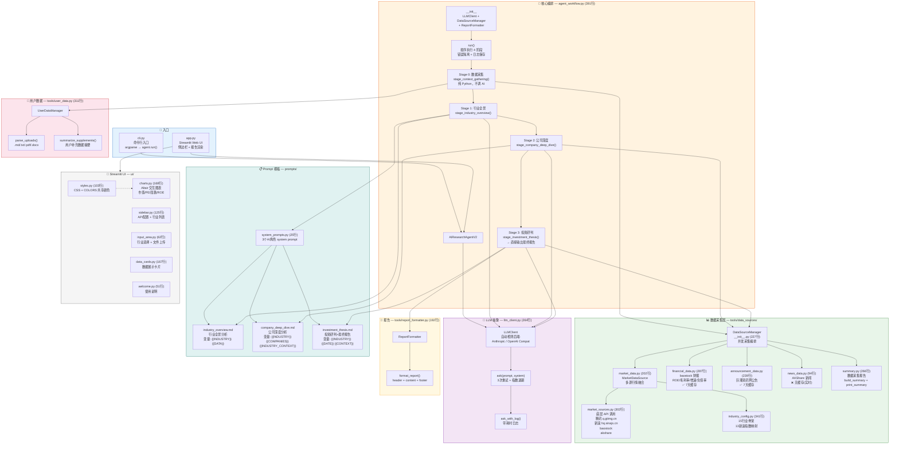

# AI Research Agent 架构流程图



## 数据流说明

```
用户输入行业名称
    │
    ▼
┌─────────────────────────────────────────────────────┐
│ Stage 0: 数据采集（纯 Python）                        │
│                                                      │
│ DataSourceManager.gather("AI算力")                    │
│   ├─ 行情: 腾讯 → 新浪 → baostock (主线程)           │
│   ├─ 财务: baostock 季报 (并发)  ←── 7天缓存         │
│   ├─ 公告: 巨潮资讯网 (并发)     ←── 7天缓存         │
│   └─ 新闻: AKShare (并发)         ←── 实时           │
│                                                      │
│ UserDataManager.parse_uploads()                      │
│   └─ 用户上传 .md/.pdf/.docx → 结构化条目            │
│                                                      │
│ → self.context = {market_data, financial_data,       │
│    announcement_data, news_data, user_supplements}   │
└──────────────────────┬──────────────────────────────┘
                       │
                       ▼
┌─────────────────────────────────────────────────────┐
│ Stage 1: 行业全景分析（AI）                           │
│                                                      │
│ 从 context 提取行情摘要 + 财务摘要 + 公告/新闻        │
│ + UserDataManager.summarize_supplements()            │
│ ↓                                                    │
│ 填入 prompts/industry_overview.md                    │
│ ↓                                                    │
│ LLMClient.ask_with_log(system=SYSTEM_PROMPTS[0])    │
│ ↓                                                    │
│ → self.context["industry_overview"]                  │
└──────────────────────┬──────────────────────────────┘
                       │
                       ▼
┌─────────────────────────────────────────────────────┐
│ Stage 2: 公司深度分析（AI）                           │
│                                                      │
│ DataSourceManager.build_company_data()               │
│ └─ 合并行情(PE/市值) + 财务(ROE/毛利率/增速/负债率)  │
│ ↓                                                    │
│ 填入 prompts/company_deep_dive.md                    │
│   + industry_context(Stage 1 输出前3000字)           │
│   + companies(15家全量数据 JSON)                     │
│ ↓                                                    │
│ LLMClient.ask_with_log(system=SYSTEM_PROMPTS[1])    │
│ ↓                                                    │
│ → self.context["company_deep_dive"]                  │
└──────────────────────┬──────────────────────────────┘
                       │
                       ▼
┌─────────────────────────────────────────────────────┐
│ Stage 3: 投资研判 → 最终报告（AI）                    │
│                                                      │
│ 输入分为两层（防级联幻觉）:                           │
│ ① 原始采集数据: PE/ROE/增速/负债率 统计量            │
│ ② AI分析(仅参考): Stage1 + Stage2 输出               │
│ ↓                                                    │
│ 填入 prompts/investment_thesis.md                    │
│ ↓                                                    │
│ LLMClient.ask_with_log(system=SYSTEM_PROMPTS[2])    │
│ ↓                                                    │
│ ReportFormatter.format_report()                      │
│ ↓                                                    │
│ → demo_output/行业_行业扫描报告_时间戳.md             │
└─────────────────────────────────────────────────────┘
```

## 关键设计决策

| 决策 | 说明 |
|------|------|
| **Stage 0 不调 AI** | 数据采集纯 Python 汇总，避免"AI 传话"导致数据失真 |
| **Stage 3 直出最终报告** | 不再需要单独的"报告格式化 LLM 调用" |
| **原始数据 + AI 分析并列** | Stage 3 同时收到原始 JSON 和 AI 文本，防级联幻觉 |
| **baostock 主线程** | baostock 连接不能跨线程共享 |
| **财务/公告 7 天缓存** | 季报不频繁更新；行情和新闻实时拉取 |
| **多源融合** | 价格 腾讯>新浪>baostock，PE 腾讯实时>baostock日线 |
